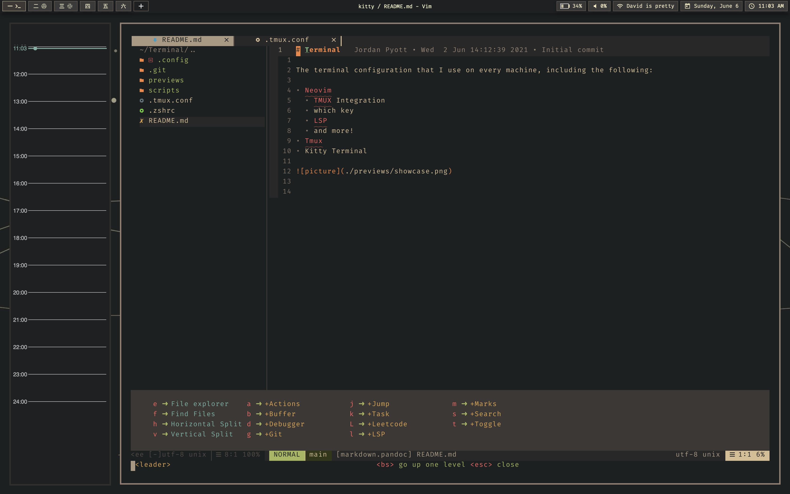

# Terminal

The terminal configuration that I use on every machine, including the following:

- Neovim
  * TMUX Integration
  * which key
  * LSP
  * and more!

Best served with tmux, config's for which can be found [here](https://github.com/atidyshirt/Terminal)

